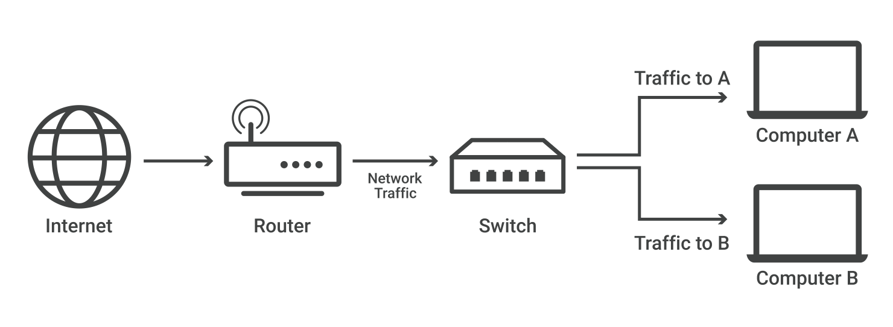
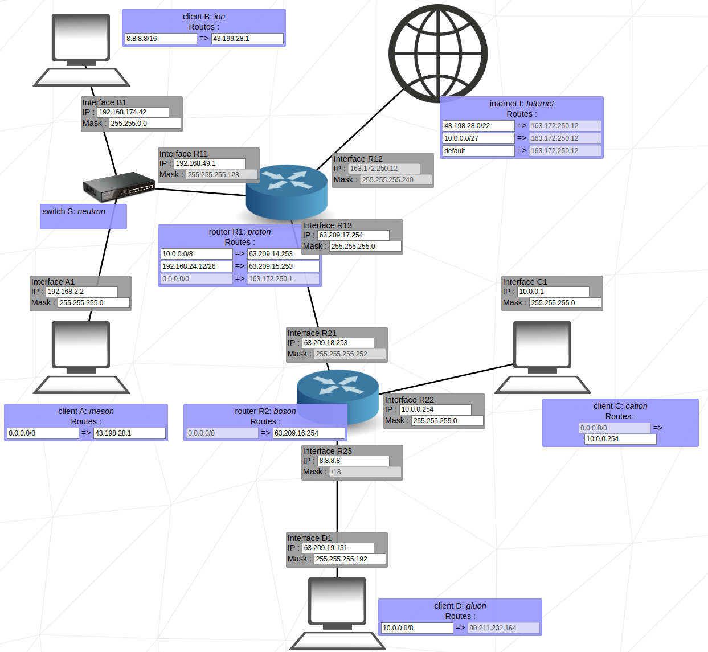

# Net Practice

[Tale of the Two Tails](https://www.deezer.com/us/track/1946027917)

## Rules

For two clients to communicate, they must share the same mask.

## Definitions

- **IP** : unique identification of a device connected to internet.
    
    *Example* : 141.213.127.13
    
    | 141.213 | 127 | 13 |
    | --- | --- | --- |
    | UMich network | Medicine department | Lab computer |
    
    ⚠️ When a network is connected to the internet, **it cannot use an IP address from the reserved private IP addresses**. The following ranges are reserved for private IP addresses:
    
    ```
    192.168.0.0 – 192.168.255.255 (65,536 IP addresses)
    172.16.0.0 – 172.31.255.255   (1,048,576 IP addresses)
    10.0.0.0 – 10.255.255.255     (16,777,216 IP addresses)
    ```
    
- **Router** : A router is a device that connects two or more packet-switched networks or sub networks.
    
    Unlike a router, a switch only sends data to the single device it is intended for (which may be another switch, a router, or a user's computer), not to networks of multiple devices.
    
- **Switch** : A network switch connects devices within a network and forwards data packets to and from those devices.



## Net Practice

<details>
<summary>Level 1</summary>

<details>
<summary>Image</summary>


</details>

Client A and Client B must communicate with each other. By looking at their masks, we deduce that their IP addresses will start with 104.93.23 followed by a decimal ranging between ]0, 255[.

Same goes for C and D, but the last 16-bits are free.

<aside>
💡 In a close connection like this one, having such a wide range of mask may seem un-optimized. A great mask would be 255.255.255.252 (**/30**). The first 30 bits are used for the network prefix and the last 2 are use to identify the host. Since you can't use 00 (network id) nor 11 (broadcast message) you have $2^2 - 2 = 2$ usable addresses.

</aside>
</details>

---

<details>
<summary>Level 2</summary>

<details>
<summary>Image</summary>


</details>
        
    
The idea is the same : every client should have the same mask to communicate with each other. We the have to choose an IP within the range of the mask.

255.255.255.255 = 32-bits

255.255.255.224 = 27-bits

32-bits - 27-bits = 5**-bits** available ranging from ]223, 192[ in decimal.
</details>

---
  
<details>
<summary>Level 3</summary>

<details>
<summary>Image</summary>


</details>
        
    
The switch is here to connect multiple devices within a network. In practice, it doesn’t change anything : apply the same mask to all devices and choose an IP within its range.

255.255.255.255 = 32-bits

255.255.255.128 = 25-bits

32-bits - 25-bits = **7-bits** available ranging from ]127, 0[ in decimal.
</details>

---

<details>
<summary>Level 4</summary>

<details>
<summary>Image</summary>


</details>
        
    
Here, we need to connect two clients to each other and a switch to a router. This may not look like it, but the configuration is exactly the same as Level 3 : we have to connect three devices. Even simpler, we don’t have any required masks !

Interface R2 and R3 are here to confuse you, the don’t interact with the R1 network.

<aside>
💡 Bonus : which mask could minimize the number of possible IP addresses ?

</aside>

- Answer
    
    If we want to optimize the mask, we are looking for at least 3 possible IP addresses. We know that 2-bits leaves us 2 possible IP addresses, so 3-bits should be enough. That is 32-3 = 2932−3=29.
</details>
   
---
     
<details>
<summary>Level 5</summary>

<details>
<summary>Image</summary>


</details>
        
    
**Static route** :  A static route is used when a computer wants to reach someone outside of its network (these are the purple boxes with ⇒). If the destination matches the left side, it will ask the right side to forward the message.

<aside>
💡 In the Internet Protocol (IP), the address **0.0.0.0** is a non-routable meta-address used to designate an **invalid, unknown or non-applicable target**. It is also written default

</aside>

Let’s take the example of Machine B. For B to communicate with Machine A, he asks the router to send packages to Machine A’s IP address. The router responds that this address is unknown. So the default static route takes over. 

In this exercise, the default route should redirect unknown addresses to the router. 
</details>
    
---

<details>
<summary>Level 6</summary>

<details>
<summary>Image</summary>


</details>
        
    
The internet must send its packets to Client A. To do so, the internet's destination must match the network address of Client A*.* Refer to level 3 to find Client A IP address.

<aside>
💡 Don’t forget to put Client A’s mask inside the static route of the internet !

</aside>
</details>
    
---

<details>
<summary>Level 7</summary>

<details>
<summary>Image</summary>


</details>
        
    
Here, we have to connect two devices three times. As seen in Level 1, we can use the mask /30 to connect 2 devices.

About the static routes, the logic is very similar to Level 5 : if an address is unknown to the network, ask to the neighbor !

<aside>
↔️ A1 ⇒ R11 ; R1 ⇒ R2

</aside>

<aside>
↔️ C1 ⇒ R22 ; R2 ⇒ R1

</aside>
</details>
    
---

<details>
<summary>Level 8</summary>

<details>
<summary>Image</summary>


</details>
        
    
Internet wants to connect to the **network** (remember in level 1 when we said that XX.XX.XX.0 meant network ?). This helps us get the IP and the masks of Client C and Client D.

The network 136.88.238 must have the same mask, that is 255.255.255.240. It means that every IP address will take 4-bits.

In other words, Client C and Client D IP addresses will each take 4-bits from the network 136.88.238.

<aside>
💡 4-bits = 15 in decimal. To find intervals, simply add or remove $15-2 = 13$ to the last digits of the IP address

</aside>

### Intervals

| Client C | Client D | Router R2 |
| --- | --- | --- |
| 136.88.238.1 | 136.88.238.17 | 136.88.238.62 |
| 136.88.238.2 | 136.88.238.18 | 136.88.238.61 |
| … | … | … |
| 136.88.238.14 | 136.88.238.30 | 136.88.238.49 |
</details>

---

<details>
<summary>Level 9</summary>

<details>
<summary>Image</summary>


</details>
        
    
Overall, nothing complicated in this level, follow the instructions and it should be fine :

1. Connect the switch to Client A and B. Use the same masks and redirect unknown addresses properly.
2. Connect this ***network*** to the internet. Be careful, the IP address in my example is a private IP address so it won’t be able to connect to the internet.
3. Connect Client C and Client D to the router. 
4. Connect Client C to the internet.

If the redirection were done properly, it should work perfectly !
</details>
    
---

<details>
<summary>Level 10</summary>

<details>
<summary>Image</summary>


</details>
        
    
Every interface starts with the same IP address, the goal is then to properly use masks and available IP addresses.

1. *Router R1* to *Switch S1* - Covers the range **167.29.188.1 - 167.29.188.127** (mask /25).
2. *Router R2* to *Client H4* - Covers the range **167.29.188.128 - 167.29.188.191** (mask /26).
3. *Router R1* to *Router R2* - Covers the range **167.29.188.252 - 167.29.188.255** (mask /30).
4. *Router R2* to *Client H3* - Unknown range and mask :( 

The only IP addresses available for the network "Router R2 to Client H3” are ranging from ]192, 251[ in decimal. Feel free to choose the most suitable mask.
</details>